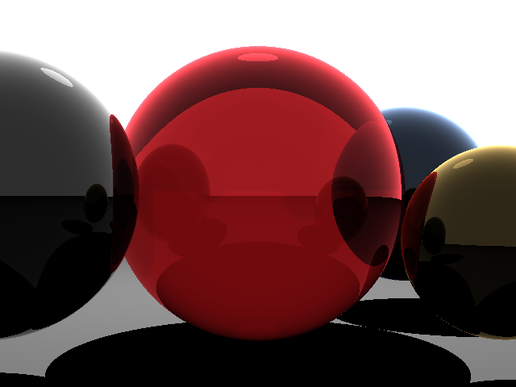

# Basic Ray Tracing

## Overview 
This is an implemenation of a ray tracing algorithm described [here](https://www.scratchapixel.com/lessons/3d-basic-rendering/introduction-to-ray-tracing "Introduction to Ray Tracing").  Much of this code has been copied from the cited source as it was intended to
be used for exploration purposes.

## Sources
* [Reflection and Refractions in Ray Tracing](https://graphics.stanford.edu/courses/cs148-10-summer/docs/2006--degreve--reflection_refraction.pdf)
* [Ray-Tracing: Generating Camera Rays](https://www.scratchapixel.com/lessons/3d-basic-rendering/ray-tracing-generating-camera-rays/generating-camera-rays)
* [Build-your-own-x GitHub Repository](https://github.com/danistefanovic/build-your-own-x)

## Result

  
   

The above render is the output of the program.  The filetype of the output is .ppm, but has been converted externally to .png for GitHub display purposes.

